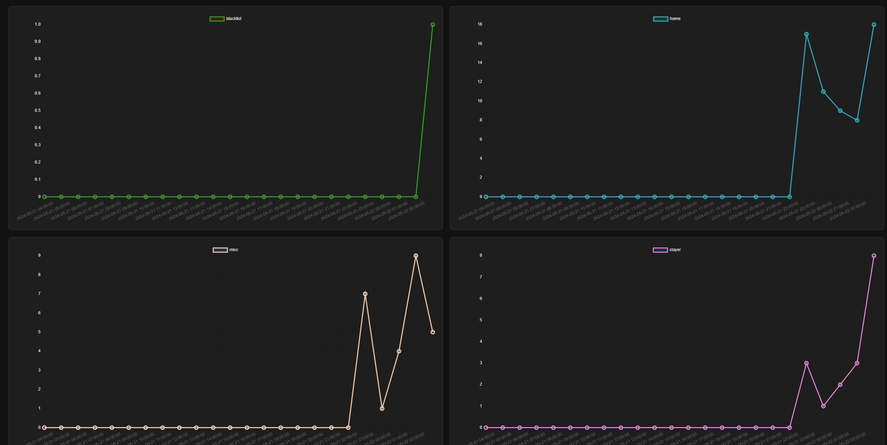

# Page visitor graph viewer!

## UI:


## Setup:
Crease a postgreSQL database with a table called analytics.
```postgres-sql
CREATE TABLE analytics(
    visit_id SERIAL PRIMARY KEY,
    page VARCHAR(50) UNIQUE NOT NULL,
    visit_time TIMESTAMP
);
```

and whenever people visit a page add it to this table.

eg:
```postgres-sql
INSERT INTO analytics (page, visit_time) 
VALUES ('home', CURRENT_TIMESTAMP);
```
